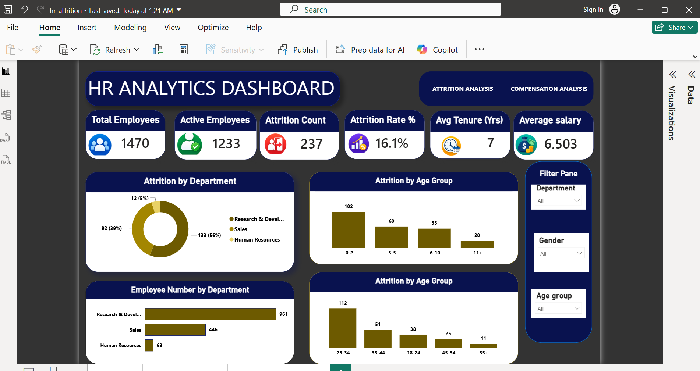
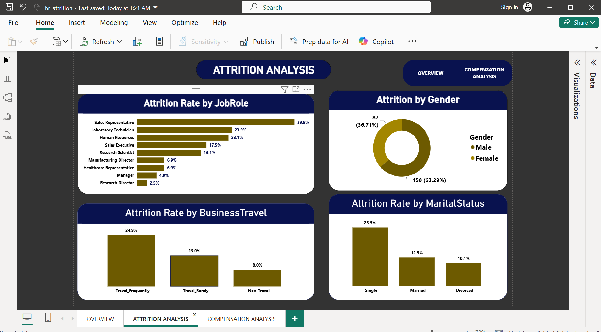
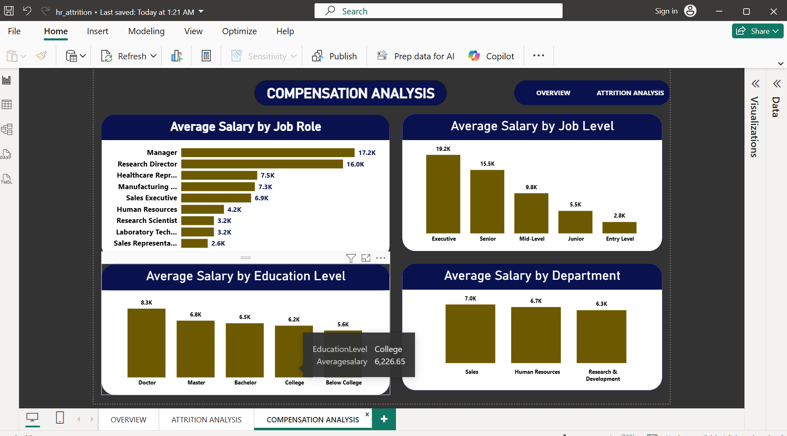

# hr-attrition-analysis

Interactive Power BI dashboard analyzing why employees leave, using the IBM HR Analytics Employee Attrition dataset (via Kaggle). Category: **HR / Workforce Analytics**.

This project identifies the strongest drivers of employee attrition — overtime, job role, tenure, pay, and work-life balance — and translates them into specific retention actions for HR and department leaders.

---

## 1. Business Problem

A company is losing employees at a rate that concerns leadership, but no one has broken down *who* is leaving and *why*. Without that, HR is guessing at fixes instead of targeting them.

This analysis answers:
- What is the company's overall attrition rate, and is it evenly spread across the business?
- Which departments, job roles, and job levels lose the most people?
- Do overtime, pay, tenure, or work-life balance actually predict who leaves?
- Where should HR focus retention budget and policy changes first?

The findings inform decisions on: which roles need urgent retention plans, whether overtime policy needs review, and how compensation compares between employees who stay and those who leave.

---

## 2. Dataset Information

- **Source:** IBM HR Analytics Employee Attrition & Performance dataset (Kaggle)
- **Rows:** 1,470 employee records
- **Structure:** Modeled as a star schema — one fact table (`Fact_Attrition`) with 27 fields, joined to 9 dimension tables (Employee, Department, Job Role, Job Level, Business Travel, Education, Rating Scale, Work-Life Balance, Performance Rating)
- **Key variables:** Attrition (Yes/No), Department, Job Role, Job Level, OverTime, Monthly Income, Years at Company, Total Working Years, Distance From Home, Business Travel, Marital Status, Gender, Work-Life Balance, Stock Option Level

---

## 3. Tools & Technologies

- **Power BI** — data modeling (star schema), DAX measures, Power Query, dashboard design
- **Microsoft Excel** — source workbook / initial validation
- **DAX** — attrition rate %, average tenure, average salary measures

---

## 4. Data Cleaning & Preparation

- Rebuilt the flat source data into a proper **star schema**: one fact table (`Fact_Attrition`) and separate dimension tables for Department, Job Role, Job Level, Business Travel, Education, and rating scales, to avoid repeating text values and keep the model efficient.
- Verified no missing `EmployeeNumber` keys before joining fact to dimensions.
- Converted numeric rating IDs (e.g., Job Satisfaction, Environment Satisfaction, Performance Rating) into their labeled scales (Low/Medium/High, Bad/Good/Better/Best) via lookup tables for readable visuals.
- Created DAX measures for Attrition Rate %, Average Tenure, and Average Salary rather than hardcoding values, so the dashboard recalculates correctly when filtered.

---

## 5. Analysis & Methodology

- Joined the fact table to all dimension tables on their surrogate keys to enable slicing by Department, Job Role, Gender, Marital Status, and Business Travel.
- Calculated attrition rate as `COUNT(Attrition = "Yes") / COUNT(all employees)`, both overall and segmented by category.
- Compared average Monthly Income, Years at Company, Total Working Years, Distance From Home, and Number of Companies Worked between employees who left vs. stayed, to test which factors separate the two groups.
- Built three linked report pages (Overview, Attrition Analysis, Compensation Analysis) with cross-filtering slicers for Department, Gender, and Age Group.

---

## 6. Key Insights & Findings

**Overall attrition rate is 16.1%** — 237 of 1,470 employees left the company, against an average tenure of 7 years and average monthly salary of $6,503.

1. **Overtime is the single strongest driver of attrition.** Employees who work overtime leave at **30.5%**, nearly **3x** the rate of those who don't (**10.4%**).
2. **Sales Representatives are the highest-risk role by far**, with a **39.8%** attrition rate — more than double the next-highest role (Laboratory Technician, 23.9%) and eight times higher than Research Directors (2.5%).
3. **Entry-level employees churn most**: **26.3%** attrition at Entry Level vs. just **4.7%** at Senior level — attrition drops sharply as job level rises.
4. **Frequent travelers leave more often**: **24.9%** attrition for employees who travel frequently, vs. **8.0%** for those who don't travel at all.
5. **Pay and tenure gaps are real**: employees who left earned **$4,787/month on average vs. $6,833** for those who stayed, and had shorter tenure (**5.1 years vs. 7.4 years**) and less total work experience (**8.2 vs. 11.9 years**).
6. **Work-life balance matters**: employees who rate their work-life balance as "Bad" leave at **31.2%**, roughly double the rate of every other category.
7. **Single employees are twice as likely to leave** as married employees (**25.5% vs. 12.5%**), and nearly 2.5x divorced employees (10.1%).
8. **Stock options correlate with retention**: employees with no stock options leave at **24.4%**, compared to **7.6–9.4%** for those holding any stock option level.

---

## 7. Visualizations

**Overview** — company-wide KPIs (headcount, attrition rate, tenure, salary) plus attrition by department and age group.

**Attrition Analysis** — attrition rate broken down by job role, gender, business travel, and marital status.

**Compensation Analysis** — average salary by job role, job level, education level, and department.

---

## 8. Recommendations

1. **Review overtime policy in Sales and R&D.** Overtime nearly triples attrition risk — audit workload distribution in the highest-overtime teams before it costs more in turnover than it saves in coverage.
2. **Build a Sales Representative retention plan.** At 39.8% attrition, this role alone likely drives a disproportionate share of total turnover; investigate compensation, quota pressure, and career-path clarity specifically for this group.
3. **Strengthen onboarding and early-career support.** With Entry Level attrition at 26.3%, focus mentorship, clear promotion timelines, and check-ins in the first 1–2 years, where the data shows the highest flight risk.
4. **Reassess travel-heavy roles.** Frequent travelers leave at 3x the rate of non-travelers — consider travel caps, rotation, or added compensation for high-travel positions.
5. **Extend stock option eligibility earlier.** The retention gap between zero and any stock options (24.4% vs. under 10%) suggests equity is a meaningful lever, not just a senior-level perk.
6. **Treat "Bad" work-life balance scores as an early-warning signal.** These employees leave at double the average rate — flag them for proactive manager check-ins.

---

## 9. Conclusion

This analysis shows attrition at this company is not random — it clusters tightly around overtime, the Sales Representative role, entry-level tenure, and frequent travel. Employees who leave are, on average, paid less, newer, and less experienced than those who stay, and poor work-life balance nearly doubles their risk of leaving.

**What I learned:** building a proper star schema (rather than one flat table) made the DAX measures and cross-filtering dramatically simpler, and confirmed how much cleaner categorical breakdowns become once IDs are mapped to labels early.

**Next steps:** with additional data, I'd extend this into a predictive attrition-risk score per employee (logistic regression or a simple scorecard) and add a cost-of-turnover estimate per department to prioritize the recommendations above by dollar impact.

---

## 10. Files & Links

- **Dataset:** [IBM HR Analytics Employee Attrition & Performance — Kaggle](https://www.kaggle.com/datasets/pavansubhasht/ibm-hr-analytics-attrition-dataset)
- **Dashboard file:** `HR_Attrition.xlsx` / `hr_attrition.pbix` (this repo)
- **Screenshots:** `/screenshots` folder (this repo)
- **GitHub repository:** https://github.com/bramwelsamwel16/hr-attrition-analysis
